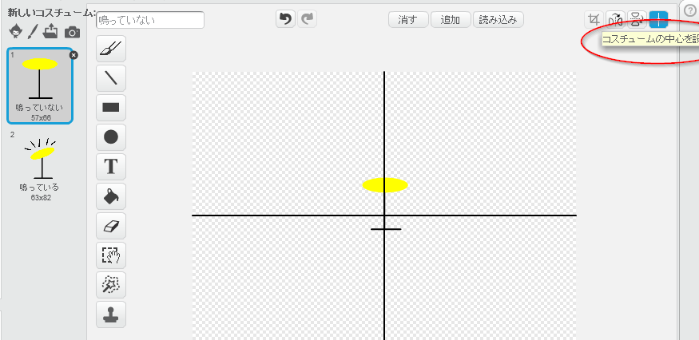
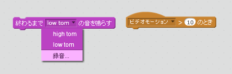

--- challenge ---

## チャレンジ: 自分のバンドを作ろう

このプロジェクトで学んだことを使って自分のバンドを作りましょう！　どんな楽器でも好きなものを作ることができます。すでにある音と楽器を見てみましょう。

楽器は正確(せいかく)である必要はありません。たとえば、マフィンでピアノを作ることもできます！

すでにあるスプライトを使うこともできますし、自分で絵を描くこともできます。

--- collapse ---
---
title: コスチュームが変わるときに、スプライトが「ジャンプ」するのはどうして？
---

+ 自分のスプライトを作るとき、クリックしてコスチュームが変わるときにスプライトが「ジャンプ」することに気づいたかもしれません。 これは2つのコスチュームが同じ位置にそろっていないからです。

直すには、 2つのコスチュームで**コスチュームの中心を設定(せってい)**をクリックし、中心が同じ位置になるようにしましょう。

--- /collapse ---

もしマイクを持っていたら、自分で録音(ろくおん)することができます。またWEBカメラを使って、自分の楽器を鳴らすこともできます。 screenshot

--- /challenge ---