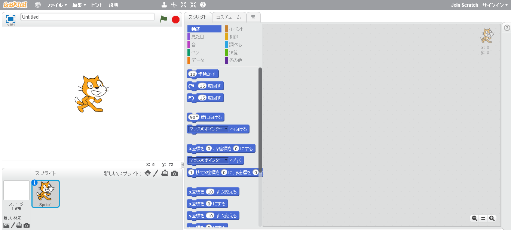
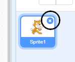
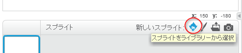
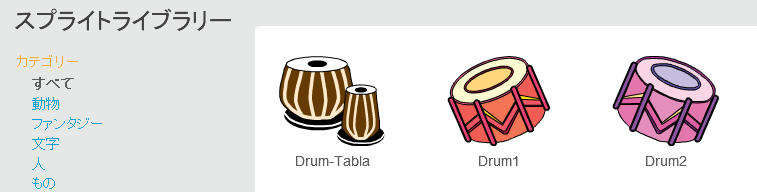
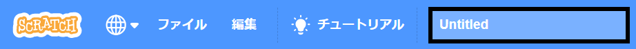
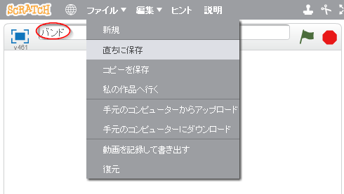

## スプライト

コーディングをはじめる前に、ある「モノ」を取り入れる必要があります。この「モノ」はScratchでは**スプライト**と呼ばれています。

\--- task \---

Open a new Scratch project.

**オンライン: **新しいオンラインScratchプロジェクトを[rpf.io/scratch-new](http://rpf.io/scratch-new){:target="_blank"}で開きます。

**Offline:** open a new project in the offline editor.

Scratchオフラインエディタをダウンロードしてインストールする必要がある場合は、[rpf.io/scratchoff](http://rpf.io/scratchoff){:target="_blank"}で見つけることができます。:

このような感じになります。

\--- /task \---

\--- task \---

The cat sprite that you can see is the Scratch mascot. You don't need it for this game, so get rid of it by right-clicking it and then clicking on **delete**.

\--- /task \---

\--- task \---

Next, click on **Choose sprite from library** to open up a list of all the Scratch sprites.

\--- /task \---

\--- task \---

Scroll down until you see a drum sprite. Click on a drum to add it to your project.

\--- /task \---

\--- task \---

ドラムをクリックしてステージの下までドラッグします。

\--- /task \---

\--- task \---

上にあるテキストボックスに名前を入力して、プログラムに名前をつけます。

**ファイル** をクリックし、**今すぐ保存**をクリックするとプロジェクトを保存することができます。

オンラインでない場合、またはスクラッチアカウントを持っていない場合は、代わりに**コンピュータに保存**をクリックしてプロジェクトのコピーを保存できます。

\--- /task \---