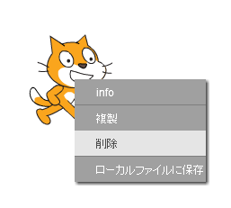
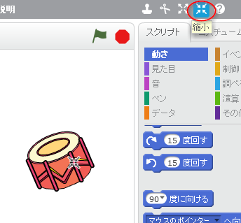

## スプライト

コーディングをはじめる前に、ある「モノ」を取り入れる必要があります。この「モノ」はスクラッチでは**スプライト**と呼ばれています。

+ まず、スクラッチエディタを開きます。オンラインスクラッチエディタは、<a href="http://jumpto.cc/scratch-new" target="_blank"> jumpto.cc/scratch-new</a> にあります。これは次のようになります。
    
    

+ 目の前に見えるネコのスプライトはスクラッチのマスコットです。右クリックしてから **削除** （さくじょ）をクリックして、消しましょう。
    
    

+ Next, click **Choose sprite from library** to open up a list of all the Scratch sprites.
    
    

+ ドラムのスプライトが表示されるまで下にスクロールします。ドラムをクリックし、**OK** をクリックします。プロジェクトに追加しましょう。
    
    

+ **縮小（しゅくしょう）**アイコンをクリックし、ドラムを数回クリックして小さくします。
    
    

左上角にあるテキストボックスに名前を入力して、プログラムに名前を付けます。

**ファイル** をクリックし、 **直ちに保存（ほぞん）** をクリックしてプロジェクトを保存することができます。 スクラッチのアカウントを持っていない場合は、 **手元のコンピュータにダウンロード** をクリックしてプロジェクトのコピーを保存できます。

