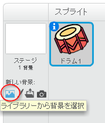

## ステージ

**ステージ**は右のエリアで選択できます。ここでプロジェクトは動きます。本物のステージのように、パフォーマンスエリアと考えてください！

\--- task \---

At the moment, the stage is white and looks pretty boring! Add a backdrop to it by clicking on **Choose a backdrop**.

\--- /task \---

\--- task \---

Click on **Indoors** in the list at the top. Then click on a theatre backdrop.

\--- /task \---

\--- task \---

Your stage should now look similar to this:

\--- /task \---