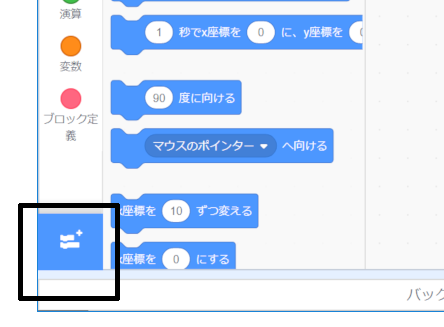
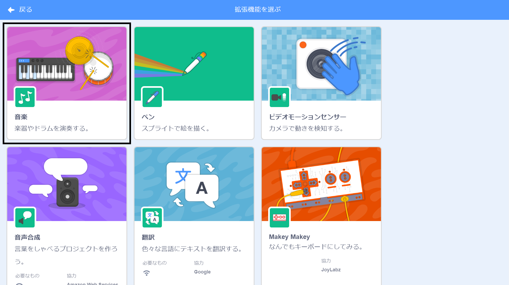
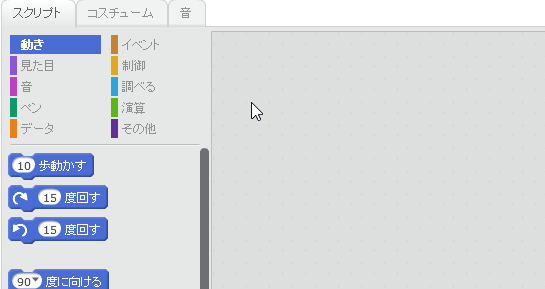

## ドラムを作ろう

次に、ドラムがクリックされたときに音が鳴るように、ドラムにコードを追加します。

コードタブの中にコードのブロックがあります、すべて色付けされています！

--- task ---

はじめに**音楽**拡張機能を加えると、楽器を演奏できます。

左下隅の**拡張機能を追加**ボタンをクリックします。



クリックして**音楽**拡張機能を追加します。



--- /task ---

--- task ---

ドラムスプライトをクリックし、これら2つのブロックを右のコードエリアにドラッグします。

```blocks3
このスプライトがクリックされたとき、(\(1\) スネアドラム v) のドラムを (0.25) 拍鳴らす
```

--- no-print ---



--- /no-print ---

ブロックが (LEGOブロックのように) 一緒につながっていることを確認してください。

--- /task ---

--- task ---

ドラムをクリックして、鳴らしてみてください！

--- /task ---