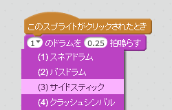
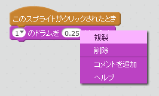

## チャレンジ: ドラムの改良（かいりょう）

ドラムをクリックしたときの音を変えることはできますか？



スペースキーを押したときにドラムが鳴るようにできますか？この`イベント`{:class="block3events"}ブロックが必要になります。

```blocks3
[スペースv]キーが押されたとき
```

コードをコピーしたい時は、コードを右クリックして、**複製**をクリックします 。

