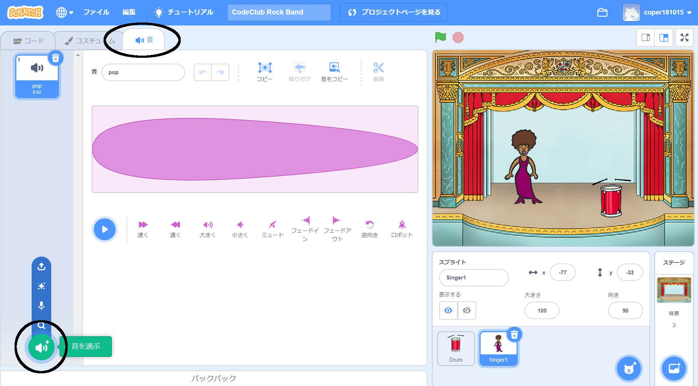

## 歌手を作ろう

バンドに歌手を追加します！

--- task ---

歌手のスプライトをステージに追加します。


[[[generic-scratch3-sprite-from-library]]]

--- /task ---

--- task ---

歌手に歌を歌わせる前に、歌手のスプライトにサウンドを追加する必要があります。 歌手のスプライトが選択されていることを確認してから、サウンドタブをクリック、そして**音を選ぶ**をクリックします。



--- /task ---

--- task ---

上部のリストから**声**をクリック、そしてスプライトに追加するサウンドを選択します。


--- /task ---

--- task ---

サウンドを使用するには、歌手のスプライトに次のコードブロックを追加します。

```blocks3
このスプライトが押されたとき、終わるまで (Singer1 v) の音を鳴らす
```

--- /task ---

--- task ---

歌手をクリックして、ちゃんと歌うか確認しましょう。

--- /task ---