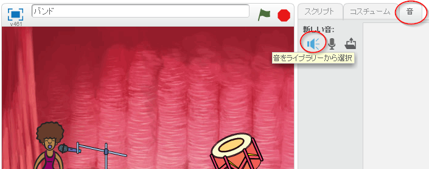

## 歌手を作ろう

バンドに歌手を追加しましょう！

+ ステージに２つのスプライト、歌手とマイクを追加してください。
    
    

+ 歌手に歌わせる前に、スプライトに音を追加する必要があります。 歌手をクリックしてから、「音」タブをクリック、そして**音をライブラリーから選択**をクリックしてください。
    
    

+ 左側の**ボーカル**をクリックして、スプライトに追加する音を選びましょう。
    
    

+ 音が追加されました。次は、このコードを自分の歌手に入れてください。
    
    ```blocks
        このスプライトがクリックされたとき
        終わるまで [singer1 v] の音を鳴らす
    ```

+ 歌手をクリックして、ちゃんと歌うか確認しましょう。