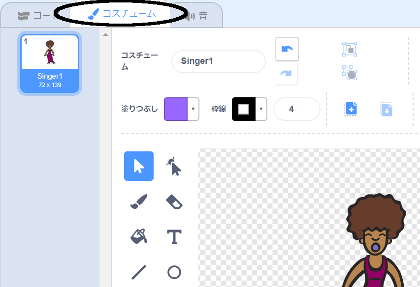
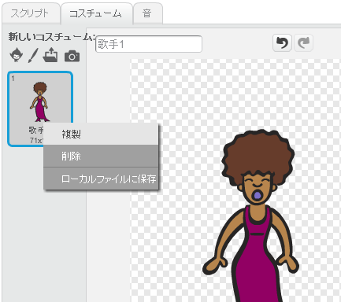
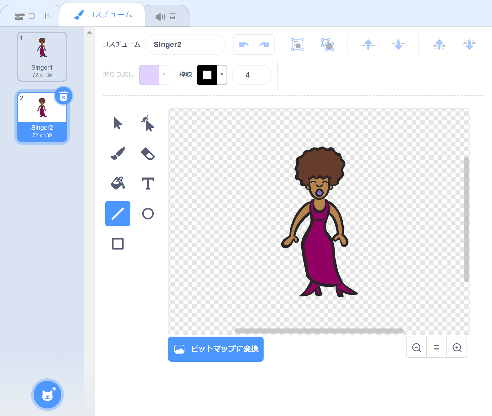
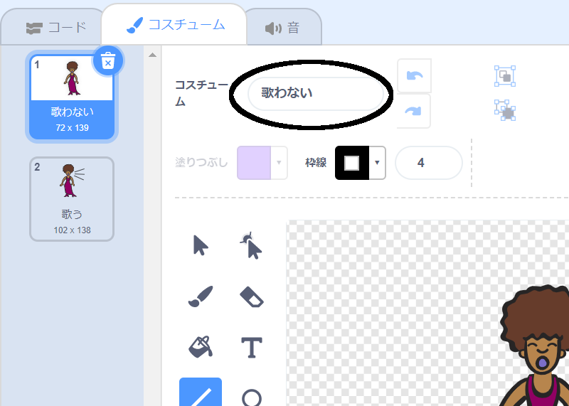

## コスチューム

歌手が歌っているように見せましょう！

\--- task \---

新しいコスチュームを作成することで、クリックしたときに歌手のスプライト見え方を変えることができます。コスチュームタブをクリックすると、歌手のコスチュームが表示されます。



\--- /task \---

\--- task \---

コスチュームを右クリックし、**複製**をクリックするとコピーを作成します。



\--- /task \---

\--- task \---

新しいコスチューム（『Singer2』という名前です）をクリックして、直線ツールを使い、歌手が歌っているように線を引きましょう。



\--- /task \---

\--- task \---

コスチュームの名前は今のところあまり役に立ちません。コスチュームのテキストボックスに入力して、名前を「歌わない」と「歌う」に変更します。



\--- /task \---

\--- task \---

歌手のコスチュームが2種類になったので、表示する衣装を選択できます！これら2つのコードブロックを歌手のスプライトに追加します。

```blocks3
このスプライトが押されたとき
+コスチュームを(歌うv) にする
終わるまで(singer1 v) の音を再生する
+コスチュームを(歌わないv) にする
```

コスチュームを変えるブロックは、`見た目`{:class="blocklooks"}のところにあります。

\--- /task \---

\--- task \---

自分の歌手をクリックしてみてください。歌っているように見えますか？

\--- /task \---

\--- task \---

ドラムが叩かれているように見せてください！


- 歌手のスプライトのコスチュームを変更する手順に従ってください。

新しいコードが動くかどうか、テストするのを忘れないようにしましょう！

\--- /task \---