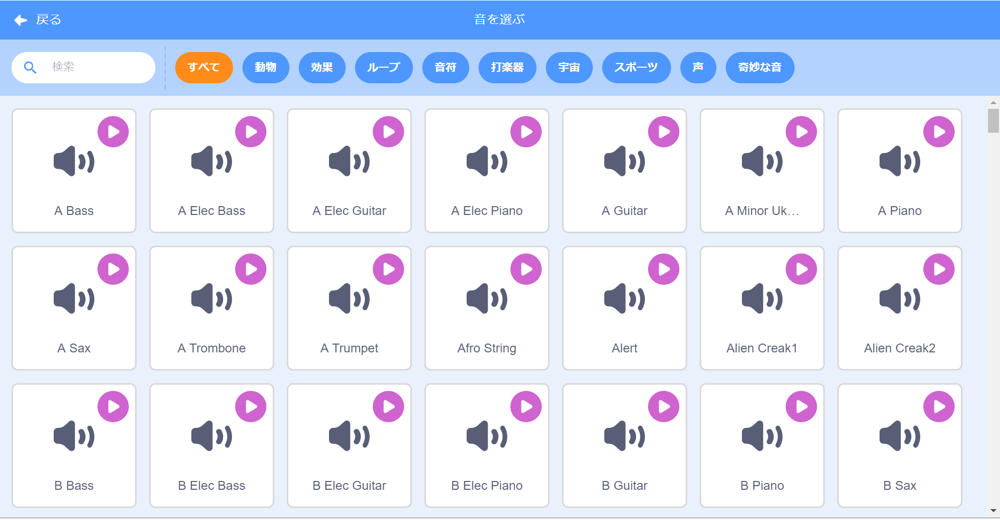

## Challenge: バンドをより良くする

自分のバンドを作ったこのプロジェクトで学んだことを使いましょう！好きな楽器を作成できます — 使用可能な楽器のスプライトとサウンドを見て、アイデアをつかんでください。



```blocks3
このスプライトがクリックされた時
楽器を (\(1\) ピアノv) に設定します
演奏(60) を(0.25) 拍します
```

ただし、楽器は本当である必要はありません。たとえば、マフィンで作られたピアノを作ることができます！


ライブラリからより多くのスプライトを使用でき、独自のスプライトを描くこともできます！


## \--- collapse \---

## title: コスチュームが変わるときに、スプライトが「ジャンプ」するのはどうして？

自分のスプライトを作るとき、クリックしてコスチュームが変わるときにスプライトが「ジャンプ」することに気づいたかもしれません。 これは2つのコスチュームが同じ位置にそろっていないからです。

To fix this, make sure that the centres of your sprite's costumes are the same.

\--- /collapse \---

If you have a microphone, you can record your own sounds, and you can even use a webcam to hit your instruments!

