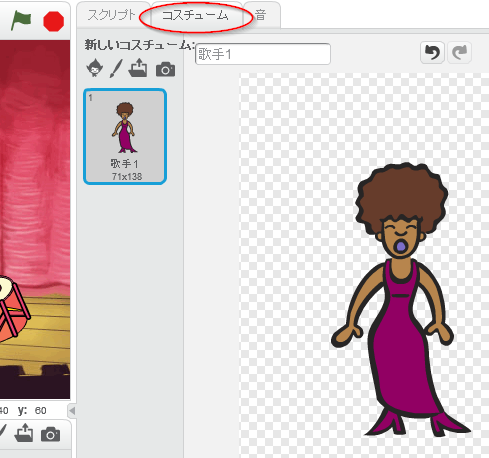
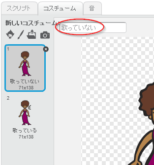
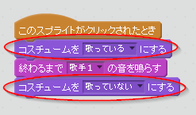

## コスチューム

歌手が歌っているように見せましょう！

+ 新たにコスチュームをつくることで、クリックしたときの歌手の見え方を変えることもできます。「コスチューム」タブをクリックすると、歌手の画像（がぞう）が出てきます。
    
    

+ コスチュームを右クリックして、**複製**をクリックするとコスチュームのコピーを作りましょう。
    
    

+ 新しいコスチューム（『Singer2』という名前です）をクリックして、直線ツールを使い、歌手が歌っているように線を引きましょう。
    
    

+ コスチュームの名前がわかりづらいので、「歌っていない」と「歌っている」に名前を書きかえましょう。それぞれのコスチュームのテキストボックスに入力してください。
    
    

+ みなさんの歌手には２種類のコスチュームができました。どちらのコスチュームを表示（ひょうじ）させるか自分で選ぶことができます。この２つのブロックを自分の歌手に追加してください。
    
    
    
    コスチュームを変えるブロックは、`見た目`{:class="blocklooks"}のところにあります。

+ 自分の歌手をクリックしてみてください。歌っているように見えますか？