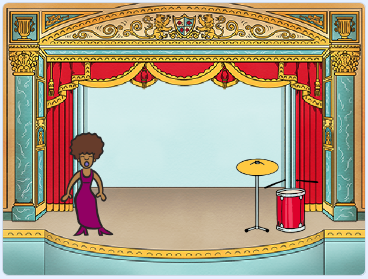

\--- no-print \---

이 프로젝트의 **스크래치 3** 버전입니다. [프로젝트의 스크래치 2 버전](https://projects.raspberrypi.org/en/projects/rock-band-scratch2)도 있습니다.

\--- /no-print \---

## 들어가며

자신만의 악기를 코드로 만드는 법을 배워보세요!

### 만들 작품

\--- no-print \---

Click the green flag to begin. Then, click on the singer or the drum to hear what they sound like.

  <iframe allowtransparency="true" width="485" height="402" src="https://scratch.mit.edu/projects/embed/276872220/?autostart=false" frameborder="0" scrolling="no"></iframe>

\--- /no-print \---

\--- print-only \---

You will make a game where you can click on the singer or the drum to hear singing or drum sounds.

\--- /print-only \---

## \--- collapse \---

## title: 배우게 될 것

+ 스크래치에서 스프라이트의 모양을 변경하는 코드 제작
+ 스프라이트에서 입력을 받게 만들기
+ Add sounds to a sprite in Scratch

\--- /collapse \---

## \--- 중간생략 \---

## title: 준비물

#### 하드웨어

+ 스크래치 3을 실행할 수 있는 컴퓨터

#### 소프트웨어

+ Scratch 3 (either [online](https://rpf.io/scratchon){:target="_blank"} or [offline](https://rpf.io/scratchoff){:target="_blank"})

\--- /collapse \---

## \--- collapse \---

## title: 교육자를 위한 추가 정보

\--- no-print \---

If you need to print this project, please use the [printer-friendly version](https://projects.raspberrypi.org/en/projects/rock-band/print){:target="_blank"}.

\--- /no-print \---

You can find the [completed project here](https://rpf.io/p/en/rock-band-get).

\--- /collapse \---