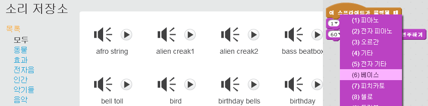
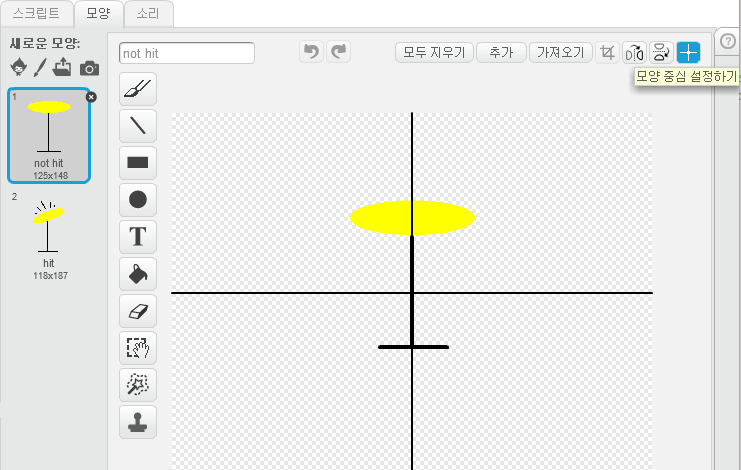
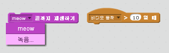

--- challenge ---

## 도전 과제 : 나만의 밴드 만들기

이 프로젝트에서 배운 것을 사용하여 밴드를 만들어봐요! 원하는 어떤 악기든 만들 수 있어요. 소리 저장소와 스프라이트 저장소를 보면서 새 아이디어를 떠올려 보세요.

말도 안되는 악기도 괜찮아요! 머핀이나 오렌지로 이루어진 피아노처럼 말이에요.

저장소에서 스프라이트를 선택할 수도 있지만, 직접 그린 자신만의 스프라이트를 사용할수도 있어요.

--- collapse ---
---
title: 제 스프라이트는 왜 모양이 바뀔때 '점프'를 하죠?
---
+ 자신의 스프라이트를 만들 때 스프라이트를 클릭하면 의상이 바뀌면서 스프라이트가 튀어 나오는 것을 볼 수 있습니다. 이것은 두 모양이 같은 중심에 있지 않기 때문입니다.

이 문제를 해결하려면 **모양 중심 설정**을 클릭해서 모양의 중심을 설정하고 두 모양이 같은 중심에 있는지를 확인하세요.

--- /collapse ---

마이크가 있다면 자신의 소리를 녹음하거나 심지어 웹캠을 사용하여 악기를 연주 할 수도 있습니다!

--- /challenge ---

커뮤니티 기여 번역

이 프로젝트는 노영진 가 번역하였고 한성진 가 검토하였습니다.

우리의 놀라운 번역 자원 봉사자들은 전 세계의 어린이들에게 코딩을 배울 수 있는 기회를 제공합니다. 우리 프로젝트 번역에 참여하여 더 많은 아이들에게 도움을 줄 수 있습니다. 자세한 내용은 [rpf.io/translators](https://rpf.io/translators)에서 확인하세요.