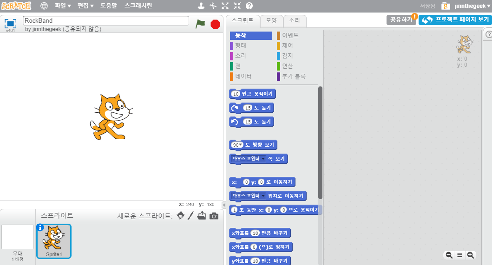
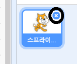
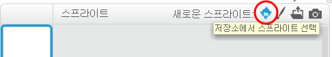
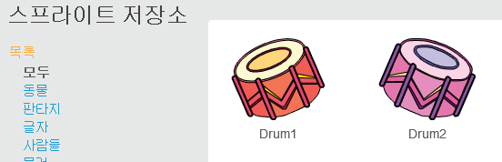
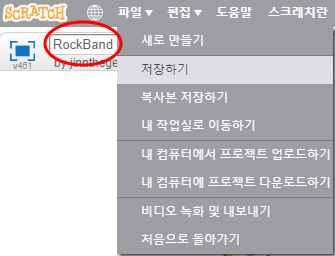

## 스프라이트

코딩을 시작하기 전에 코드에 '무언가'를 추가 해야 합니다. 스크래치에서 이 '무언가'는 **스프라이트**라고 합니다.

\--- task \---

새로운 스크래치 프로젝트를 엽니다.

**온라인:** [rpf.io/scratch-new](http://rpf.io/scratch-new){:target="_ blank"}에서 새로운 온라인 스크래치 프로젝트 열기

**오프라인 :** 오프라인 편집기에서 새 프로젝트를 엽니다.

스크래치 오프라인 에디터를 다운로드 받아야 하는 경우, [rpf.io/scratchoff](http://rpf.io/scratchoff){:target="_blank"}에서 다운 받을 수 있습니다.

그림으로 보면 다음과 같습니다.

\--- /task \---

\--- task \---

당신이 볼 수 있는 고양이 스프라이트는 스크래치 마스코트입니다. 이 게임에서는 필요하지 않으므로 마우스 오른쪽 버튼으로 클릭 한 다음 을 클릭하여 제거하십시오.

\--- /task \---

\--- task \---

드럼을 클릭하여 스테이지 아래쪽으로 끕니다.

\--- /task \---

\--- task \---

그런 다음 **파일**을 클릭하고, **저장하기**를 클릭하여 프로젝트를 저장할 수 있습니다.

\--- /task \---

\--- task \---

If you are signed in to your Scratch account, type the title of your project into the project title box at the top of the screen:

**Tip:** Give your projects helpful names so that you can easily find them when you have lots of projects.

Next, click on File, and then on Save now to save your project.

If you are not online or don't have a Scratch account, you can save a copy of your project by clicking on **Save to your computer** instead.

\--- /task \---