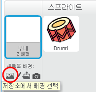

## 단계

왼쪽에 있는 **무대** 영역은 프로젝트가 살아 움직이는 공간입니다. 실제 무대처럼 공연이 이뤄지는 곳이라고 생각하면 됩니다!

\--- task \---

At the moment, the stage is white and looks pretty boring! Add a backdrop to it by clicking on **Choose a backdrop**.

\--- /task \---

\--- task \---

Click on **Indoors** in the list at the top. Then click on a theatre backdrop.

\--- /task \---

\--- task \---

Click and drag the drum to the bottom of the Stage.

\--- /task \---

\--- task \---

Your stage should now look similar to this:

\--- /task \---