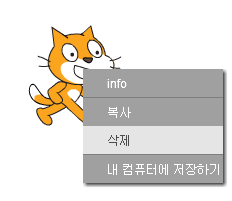
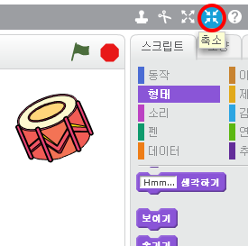

## 스프라이트

코딩을 시작하기 전에 코드에 '물건'을 추가해야합니다. 스크래치에서이 '물건'은 **스프라이트**이라고합니다.

+ 먼저 스크래치 편집기를 엽니다. 온라인 스크래치 편집기는 <a href="http://jumpto.cc/scratch-new" target="_blank">jumpto.cc/scratch-new</a>에서 찾을 수 있습니다. 다음과 같이 보입니다.
    
    

+ 고양이 스프라이트는 스크래치의 마스코트입니다. 마우스 오른쪽 버튼을 클릭 한 다음 **삭제**을 클릭하여 제거하십시오.
    
    

+ 그런 다음 **저장소에서 스프라이트 선택**을 클릭하여 모든 스크래치 스프라이트의 목록을 엽니다.
    
    

+ 드럼 스프라이트가 보일 때까지 아래로 스크롤하십시오. 드럼을 클릭하고 **확인** 을 클릭하여 프로젝트에 추가하십시오.
    
    

+ **축소** 아이콘을 클릭 한 다음 드럼을 여러번 클릭하여 작게 만듭니다.
    
    

왼쪽 상단의 텍스트 상자에 프로그램 이름을 입력하여 프로그램 이름을 지정하십시오.

그런 다음 **파일**을 클릭 한 다음 **저장하기**를 클릭하여 프로젝트를 저장할 수 있습니다. 스크래치 계정이없는 경우 **내 컴퓨터에 프로젝트 다운로드하기**를 클릭하여 프로젝트 사본을 저장할 수 있습니다.

