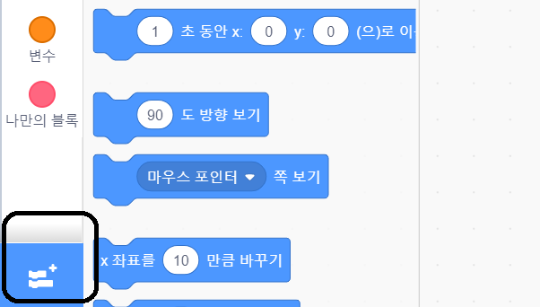
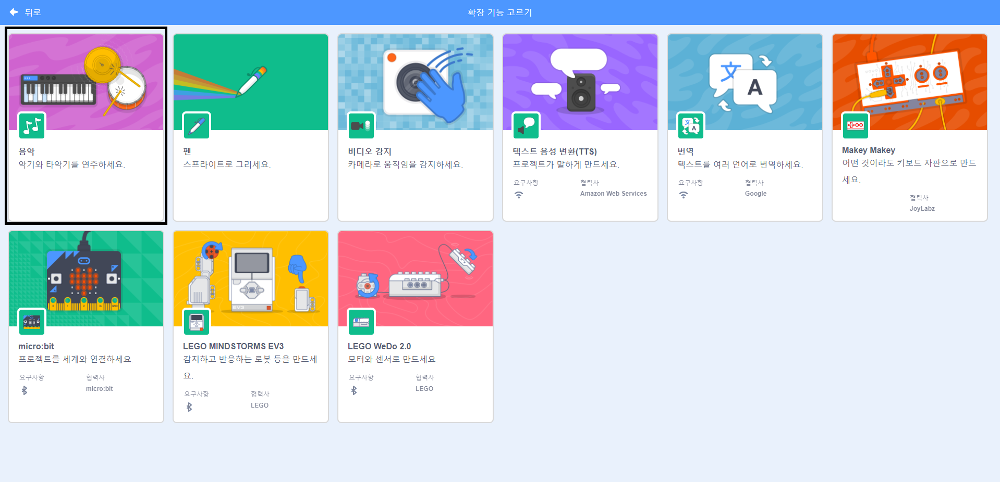
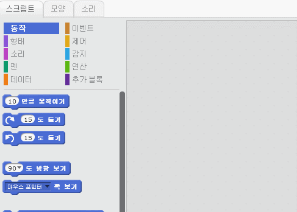

## 드럼 만들기

이제 드럼에 코드를 추가하여 클릭 할 때 소리가납니다.

스크립트 탭에서 색으로 분류되어있는 코드 블럭들을 찾을 수 있어요.

--- task ---

먼저 악기를 재생할 수 있는 **음악** 확장 기능을 추가 합니다.

왼쪽 하단에 **추가 확장** 버튼을 클릭 하십시오.



**음악** 확장 기능을 추가를 하기 위해서 클릭 하십시오.



--- /task ---

--- task --- 드럼 스프라이트를 클릭하고 이 두 블록을 오른쪽의 코드 영역으로 드래그합니다:

```blocks3
이 스프라이트를 클릭했을 때
(\(1\) Snare Drum v) 번 타악기를 (0.25) 박자로 연주하기
```

--- no-print ---



--- /no-print ---

블록이 서로 연결되어 있는지 확인하십시오 (예: LEGO블록).

--- /task ---

--- task --- 여러분이 만든 새 악기가 어떤 소리를 내는지 드럼을 클릭해 봅시다! --- /task ---