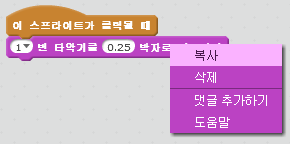

## 도전 과제 : 더 좋은 드럼 만들기

드럼을 클릭했을 때 나는 소리를 바꿀 수 있나요?


또, 스페이스바를 눌렀을 때에도 드럼이 소리가 나게 할 수 있나요? 다음의 `이벤트`{:class="blockevents"} 블럭을 사용해야 됩니다:

```blocks3
[space v] 키를 눌렀을 때
```

이미 있는 코드는 우클릭해서 **복사**를 눌러서 복사 할 수 있습니다.

