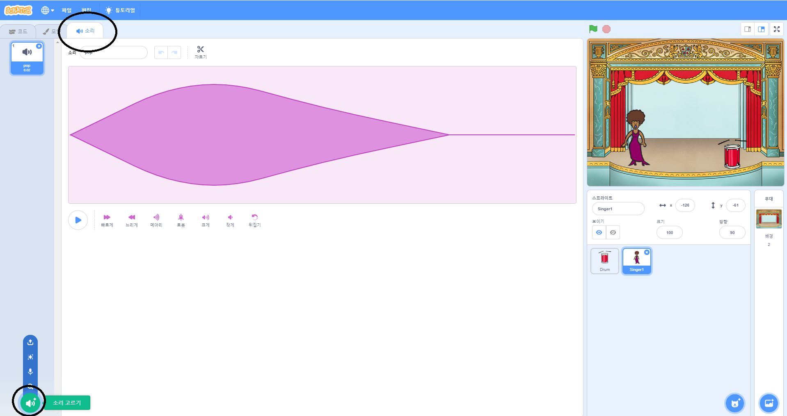
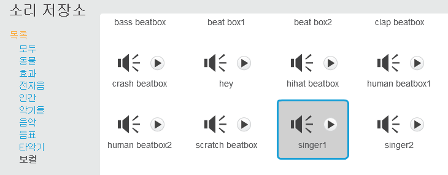

## 가수 만들기

이제 밴드에 가수를 추가하십시오!

\--- task \---

가수 스프라이트를 스테이지에 추가합니다.


[[[generic-scratch3-sprite-from-library]]]

\--- /task \---

\--- task \---

가수가 노래할 수 있게 되려면, 스프라이트에 사운드가 추가되어야 합니다. 가수를 선택하고 ‘소리’ 탭을 누르신 후 저장소에서 **소리 선택**을 클릭하세요.

 \--- /task \---

\--- task \--- 상단에 있는 목록에서 **목소리** 클릭한 다음 당신의 스프라이트에 추가 할 소리를 선택 하십시오.

 \--- /task \---

\--- task \--- 소리를 사용하려면 가수 스프라이트에 다음 코드 블록을 추가하십시오.

```blocks3
이 스프라이트를 클릭했을 때
 (singer1 v) 끝까지 재생하기
```

\--- /task \---

\--- task \--- 무대에서 가수를 클릭하고 어떻게 되는지 보십시오. 그녀가 노래 하나? \--- /task \---