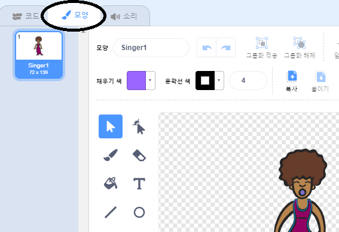
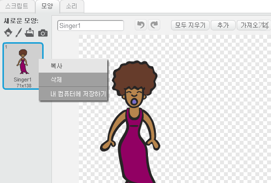
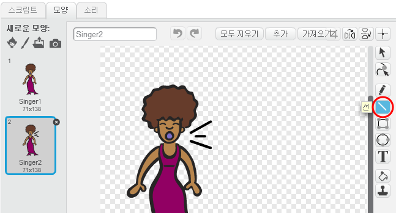
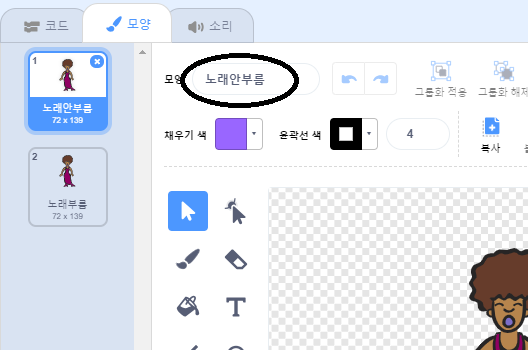

## 의상

가수가 노래하는 것처럼 보이게 해 봐요!

\--- task \---

가수 스프라이트의 새로운 모양을 만들어 클릭 할 때 어떻게 보일지 변경할 수도 있습니다. 모양 탭을 클릭하면 가수 이미지가 나타납니다.



\--- /task \---

\--- task \---

\--- task \--- 모양을 마우스 오른쪽 버튼으로 클릭하고 **복사**를 클릭하여 모양 사본을 만듭니다.



\--- /task \---

\--- task \---

의상을 변경하기 위한 코드 블록은 `형태`{:class="blocklooks"} 섹션에 있습니다 \--- /task \---



\--- /task \---

\--- task \---

모양 이름이 어울리지 않으므로, 복장의 텍스트 상자에 이름을 '노래하지 않음'과 '노래하기'로 변경하십시오.



\--- /task \---

\--- task \---

가수를 위한 두 가지 모양이 생겼으니, 어떤 모양이 표시 될지 선택할 수 있어요! 다음 두 블록을 가수에게 추가해 보세요.

```blocks3
이 스프라이트가를 클릭할 때
+(singing v) 로 의상을 바꾸기
(singer1 v) 음성을 완료 될 때까지 재생
+(노래가 아니라 v) 로 의상을 바꾸기
```

모양을 변경하기위한 코드 블록은 `형태`{:class="blocklooks"} 섹션에 있습니다.

\--- /task \---

\--- task \---

가수를 클릭 해 보세요. 그녀가 노래하는 것처럼 보이나요?

\--- /task \---

\--- task \---

드럼이 소리나고 있는 것처럼 보이게 만들 수 있나요!


- 가수 스프라이트의 의상 변경 지침을 참조하십시오.

새 코드들이 잘 작동하는지 확인하는 걸 잊지 마세요!

\--- /task \---