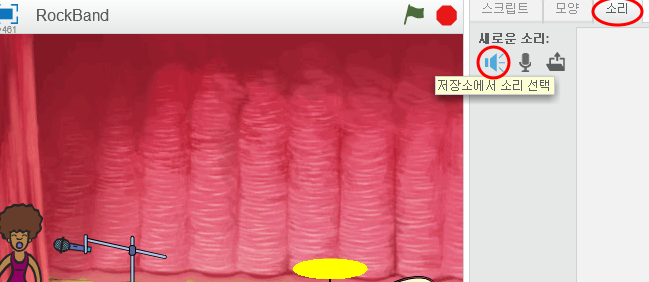

## 가수 만들기

가수를 밴드에 추가합시다!

+ 무대에 가수와 마이크를 스프라이트를 추가 해 보세요.
    
    

+ 가수가 노래할 수 있게 되려면, 스프라이트에 사운드가 추가되어야 합니다. 가수를 선택하고 ‘소리’ 탭을 누르신 후 **저장소에서 소리 선택**을 클릭하세요.
    
    

+ 왼쪽 목록에서 **보컬** 을 클릭하면 스프라이트에 추가 할 적절한 사운드를 선택할 수 있습니다.
    
    

+ 이제 사운드가 추가됐으니, 다음 코드를 가수에게 추가 해 주세요:
    
    ```blocks
        이 스프라이트를 클릭했을 때
        [singer1 v]끝까지 재생하기
    ```

+ 가수를 클릭하고 어떤 일이 일어나는지 보세요. 그녀가 노래하나요?