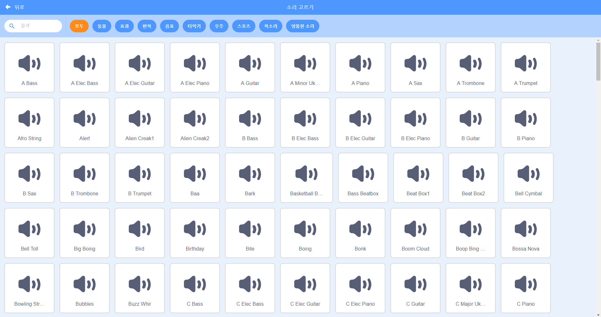

## 도전 과제: 더 좋은 밴드 만들기

이 프로젝트에서 배운 것을 사용하여 밴드를 만들어봐요! 원하는 어떤 악기든 만들 수 있어요. 소리 저장소와 스프라이트 저장소를 보면서 새 아이디어를 떠올려 보세요.



```blocks3
이 스프라이트를 클릭했을 때
악기를 (\(1\) Piano v) \(으\)로 정하기
(60) 번 음을 (0.25) 박자로 연주하기
```

말도 안되는 악기도 괜찮아요! 머핀이나 오렌지로 이루어진 피아노처럼 말이에요.


라이브러리에서 더 많은 스프라이트를 사용할 수 있으며 스프라이트를 직접 만들 수도 있습니다.


--- collapse ---
---
title: 제 스프라이트는 왜 모양이 바뀔때 '점프'를 하죠?
---

자신의 스프라이트를 만들 때 스프라이트를 클릭하면 의상이 바뀌면서 스프라이트가 튀어 나오는 것을 볼 수 있습니다. 이것은 두 모양의 중심이 같지 않기 때문입니다.

이 문제를 해결하려면 스프라이트의 의상의 중심이 동일한 지 확인하십시오.

--- /collapse ---

마이크가 있다면 자신의 소리를 녹음하거나 심지어 웹캠을 사용하여 악기를 연주 할 수도 있습니다!

