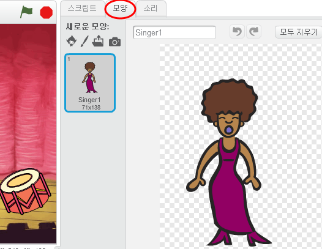
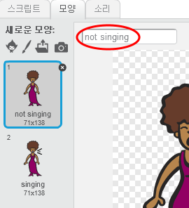

## 의상

가수가 그녀가 노래하는 것처럼 보이게하십시오!

+ 가수 스프라이트가 새로운 의상을 만들어 클릭 할 때 어떻게 보이는지 변경할 수도 있습니다. 의상 탭을 클릭하면 가수 이미지가 나타납니다.
    
    

+ 의상을 마우스 오른쪽 버튼으로 클릭하고 **복사**를 클릭하여 의상 사본을 만듭니다.
    
    

+ 새로운 의상 ('Singer2')을 클릭 한 다음 라인 도구를 선택하고 가수가 노래하는것처럼 보이게 선을 그립니다.
    
    

+ 지금 의상 스프라이트의 이름들은 별로 도움이 되지 않네요. 알기 쉽도록 두 복장의 이름을 각각 '노래하는중' '노래하지않는중' 으로 변경해 봐요.
    
    

+ 가수를 위한 두 가지 의상이 생겼으니, 어떤 의상이 표시 될지 선택할 수 있어요! 다음 두 블록을 가수에게 추가해 보세요.
    
    
    
    의상을 변경하기위한 코드 블록은 `형태`{: class = "blocklooks"} 섹션에 있습니다.

+ 가수를 클릭 해 보세요. 그녀가 노래하는 것처럼 보이나요?