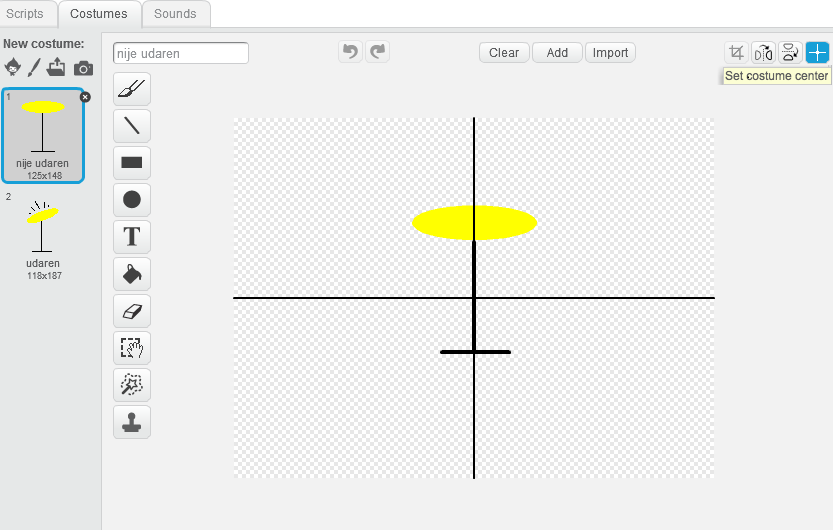

--- challenge ---

## Izazov: napravi svoju grupu

Iskoristi prethodno naučeno u ovom projektu da napraviš svoju grupu! Možeš da napraviš bilo koji instrument koji ti se sviđa — pogledaj zvukove i instrumente koje imaš na raspolaganju da dobiješ ideje.

Tvoji instrumenti ne moraju da budu vjernog izgleda. Možeš, na primjer, da napraviš klavir od mafina!

Kao što možeš da koristiš postojeće likove, možeš i da nacrtaš sopstvene.

--- collapse ---
---
title: Zašto moj lik 'skače' kada mijenja kostim?
---
+ Pri kreiranju svog lika, možeš primijetiti da, kada klikneš na njega, lik 'skače' dok mijenja kostim. To je zato što dva kostima nisu centrirana na istom mjestu.

Da to popraviš, klikni na **Set costume center** (Postavi centar kostima) za oba kostima, i pobrini se da u oba kostima centar bude u istoj tački.

--- /collapse ---

Ako imaš mikrofon, možeš da snimiš svoje zvukove ili čak da koristiš veb-kameru da sviraš svoje instrumente!

--- /challenge ---