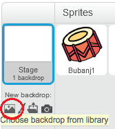
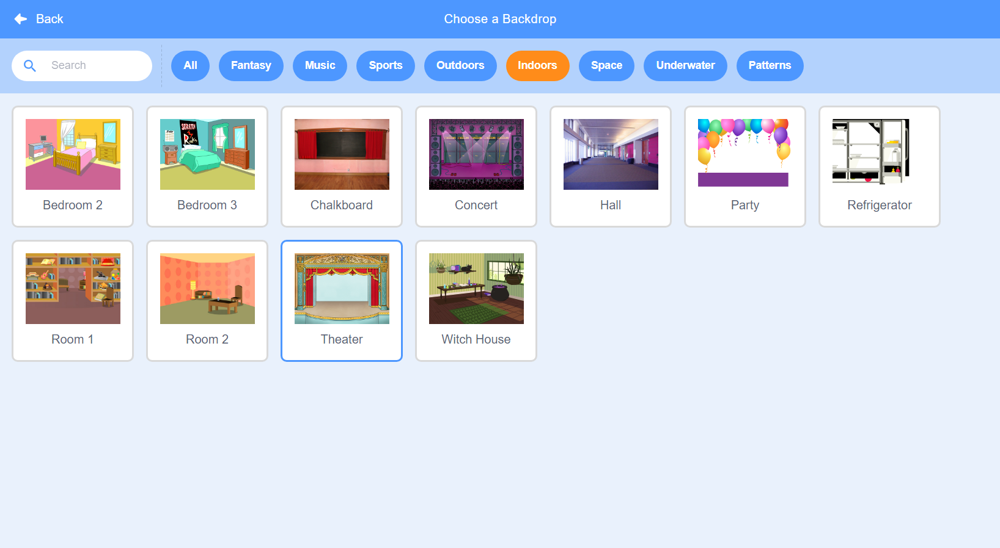

## Pozornica (stage)

**Pozornica** (stage) je prostor na lijevoj strani i tamo će tvoj projekat oživjeti. Zamisli da je to prostor za izvođenje, baš kao stvarna pozornica!

+ Trenutno je pozornica bijela i izgleda prilično dosadno! Dodajmo joj pozadinu tako što ćemo kliknuti na **Choose backdrop from library** (Izaberi pozadinu iz biblioteke).
    
    

+ Klikni na **Indoors** (Unutrašnji prostor), zatim klikni na stage backdrop (pozadinu pozornice) i, nakon toga, na **OK**.
    
    

+ Sada bi trebalo da tvoja pozornica izgleda ovako:
    
    