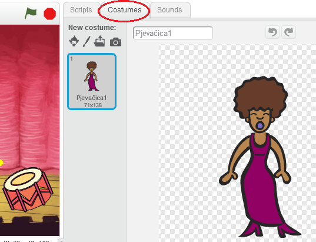
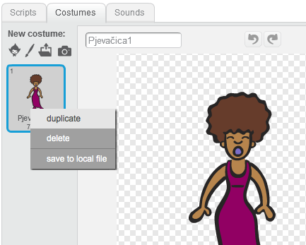
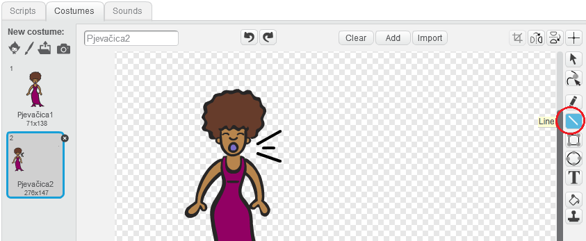
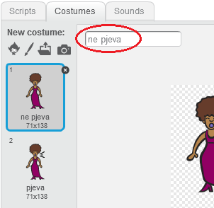
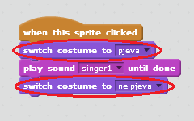

## Kostimi (costumes)

Napravimo da tvoja pjevačica izgleda kao da pjeva!

+ Možeš, takođe, da promijeniš izgled pjevačice kada se na nju klikne tako što ćeš napraviti novi kostim. Klikni na karticu Costumes (Kostimi) i vidjećeš sliku pjevačice.
    
    

+ Klikni desnim tasterom miša na kostim, a zatim klikni **duplicate** (umnoži) da napraviš kopiju kostima.
    
    

+ Klikni na novi kostim (pod nazivom 'Singer2'). Nakon toga, izaberi alat za crtanje linija i nacrtaj linije, tako da pjevačica izgleda kao da pjeva.
    
    

+ Trenutno, imena kostima nisu od velike pomoći. Preimenuj ih u ‘ne pjeva’ i ‘pjeva’ tako što ćeš za svaki kostim upisati novo ime u okvir za tekst.
    
    

+ Sada kada imaš dva različita kostima za svoju pjevačicu, možeš da izabereš koji kostim će biti prikazan. Dodaj sljedeća dva bloka pjevačici:
    
    
    
    Blok kôda za mijenjanje kostima nalazi se u odjeljku `Looks` {:class="blocklooks"}.

+ Klikni na svoju pjevačicu. Da li izgleda kao da pjeva?