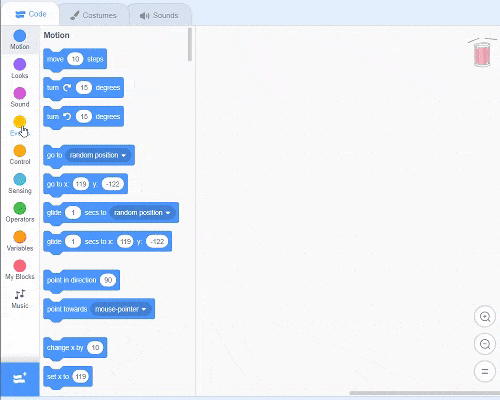

## ഒരു ഡ്രം ഉണ്ടാക്കുക

നിങ്ങളുടെ ശബ്ദം കേടുവരുമ്പോൾ ശബ്ദമുണ്ടാക്കാൻ അനുവദിക്കുക.

നിങ്ങൾക്ക് സ്ക്രിപ്റ്റുകൾ ടാബിൽ കോഡ് ബ്ലോക്കുകൾ കണ്ടെത്താം, അവ എല്ലാ നിറത്തിലും നൽകിയിരിക്കുന്നു!

+ ഡ്രം സ്പ്രിറ്റ് ക്ലിക്കുചെയ്യുക, തുടർന്ന് ഈ രണ്ട് ബ്ലോക്കുകൾ വലതുഭാഗത്ത് കോഡ് ഏരിയയിലേക്ക് വലിച്ചിടുക, അവർ ഒരുമിച്ച് കണക്റ്റുചെയ്തിട്ടുണ്ടെന്ന് ഉറപ്പുവരുത്തുക (ലെഗോ ബ്ലോക്കുകൾ പോലെ):

+ നിങ്ങളുടെ പുതിയ ഉപകരണം ശ്രമിക്കാൻ ഡ്രം ക്ലിക്കുചെയ്യുക!