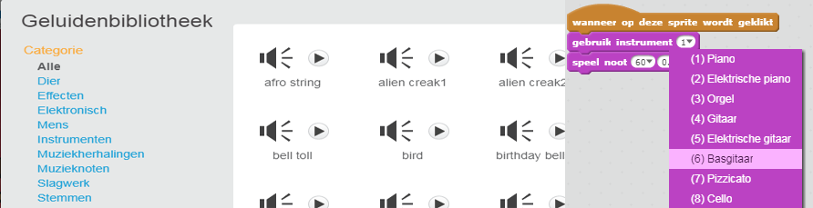
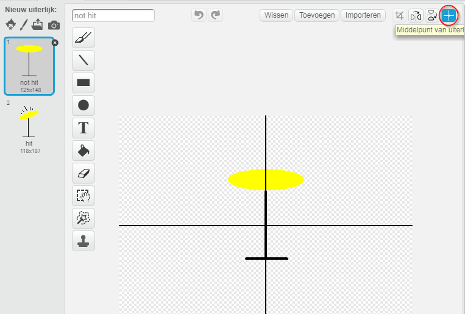

--- challenge ---

## Challenge: maak je eigen band

Gebruik wat je in dit project hebt geleerd om je eigen band te maken! Je kunt elk gewenst instrument maken - bekijk de beschikbare geluiden en instrumenten om ideeën op te doen.

Je instrumenten hoeven niet te bestaan. Je zou bijvoorbeeld een piano kunnen maken van muffins!

Je kunt niet alleen bestaande sprites gebruiken, maar ook je eigen sprites tekenen.

--- collapse ---

## titel: Waarom springt mijn sprite wanneer het uitelijk verandert?

+ Bij het maken van je eigen sprite, kan je merken dat wanneer je op de sprite klikt, deze verspringt wanneer het uiterlijk verandert. Dit komt omdat het centrum van de twee uiterlijken niet op precies dezelfde plek staan.

Klik op ** Middelpunt van uiterlijk ** om dit probleem op te lossen, en zorg ervoor dat het centrum in beide uiterlijken op hetzelfde punt staat.

--- /collapse ---

Als je een microfoon hebt kun je je eigen geluiden opnemen of zelfs een webcam gebruiken om je instrumenten te bespelen!

--- /challenge ---