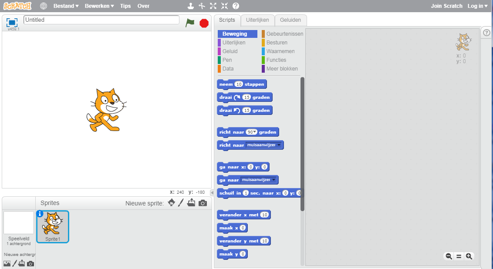
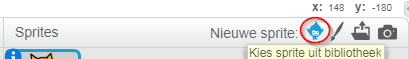
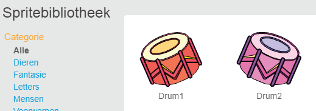
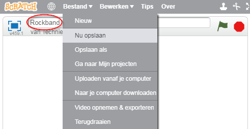

## Sprites

Voordat je met coderen kunt beginnen, moet je een 'ding' toevoegen aan de code. In Scratch worden deze 'dingen' ** sprites** genoemd.

\--- task \--- Open een nieuw Scratch project.

**Online:** open een nieuw online Scratch project op [rpf.io/scratch-new](http://rpf.io/scratch-new){:target="_blank"}.

**Offline:** open een nieuw project in de offline editor.

Als je de Scratch offline editor wilt downloaden en installeren dan kun je die vinden op [rpf.io/scratchoff](http://rpf.io/scratchoff){:target="_blank"}.

Het ziet er zo uit:

 \--- / task \--- \--- task \--- De kat-sprite die je ziet, is de Scratch-mascotte. Je hebt het niet nodig voor deze game, dus doe het weg door er met de rechtermuisknop op te klikken en vervolgens op **verwijderen** te klikken.

 \--- /task \---

\--- task -- Klik op **Kies een sprite** om de bibliotheek van alle Scratch-sprites te openen.

 \--- /task \---

\---task \--- Blader naar beneden tot je een drum sprite ziet. Klik op deze drum sprite om het aan je project toe te voegen.

\--- /task \---

\--- task \----

Klik en sleep de trommel naar de onderkant van het werkgebied.

\--- /task \---

\--- task -- Geef je programma een naam door deze in het tekstvak boven in de balk te typen.

Klik vervolgens op **Bestand** en vervolgens op **Nu opslaan** om je project op te slaan.

Als je niet online bent of geen Scratch account hebt, kun je in plaats daarvan een kopie van jouw project opslaan op je eigen computer door op **Opslaan op je computer** te klikken.

 \--- /task \---