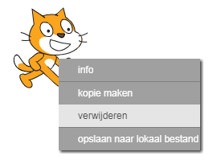
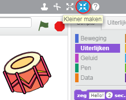

## Sprites

Voordat je met coderen kunt beginnen, moet je een 'ding' toevoegen aan de code. In Scratch worden deze 'dingen' **sprites** genoemd.

+ Open eerst de Scratch-editor. Je kunt de online Scratch-editor vinden op <a href="http://jumpto.cc/scratch-new" target="_blank"> jumpto.cc/scratch-new </a>. Het ziet er zo uit:
    
    

+ De kat sprite die je ziet, is de Scratch-mascotte. Laten we de de kat verwijderen door er met de rechtermuisknop op te klikken en vervolgens te klikken op **verwijderen**.
    
    

+ Klik op **Kies sprite uit bibliotheek** om de bibliotheek van alle Scratch-sprites te openen.
    
    

+ Blader naar beneden tot je een drum sprite ziet. Klik op een drum en klik op **OK** om het toe te voegen aan je project.
    
    

+ Klik op het **kleiner maken** pictogram en klik vervolgens een paar keer op de drum om deze kleiner te maken.
    
    

Geef je programma een naam door deze in het tekstvak in de linkerbovenhoek te typen.

Je kunt klikken op **Bestand** en vervolgens **Nu opslaan** om je project te bewaren. Als je Scratch online gebruikt maar geen Scratch-account hebt, kunt je een kopie van je project opslaan door te klikken op **Naar je computer downloaden**.

