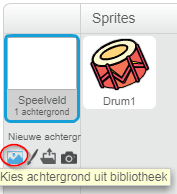
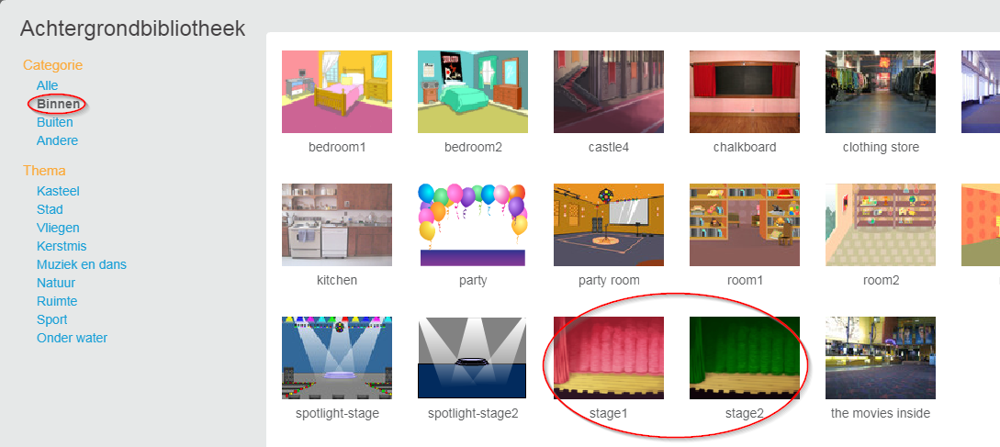

## Het speelveld

Het **Speelveld** is het gebied linksboven, waar je project tot leven komt. Zie het als het spelgebied, net als een echt toneel!

\--- task \--- Op dit moment is het podium wit en ziet het er behoorlijk saai uit! Voeg een achtergrond toe door op **Kies een achtergrond** te klikken.

 \--- /task \---

\--- task \--- Klik op **Binnen** in de lijst bovenaan. Klik vervolgens op de Theater achtergrond.

 \--- /task \---

\--- task \--- Je speelveld zou er nu ongeveer zo uit moeten zien:

 \--- /task \---