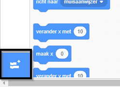
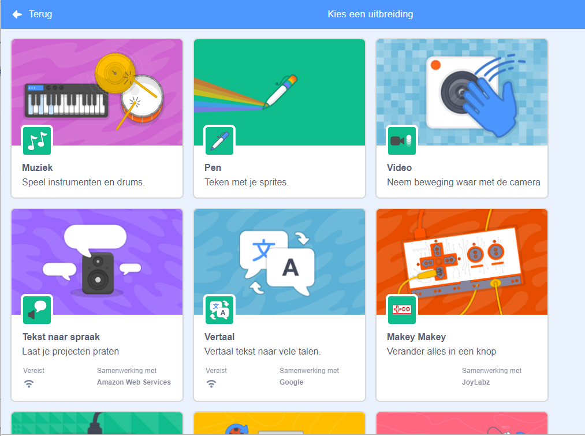
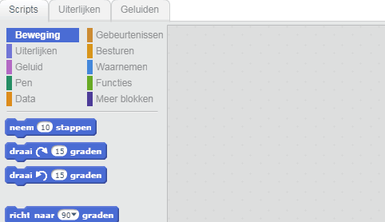

## Een trommel maken

Nu ga je code aan je drum toevoegen zodat de drum een geluid maakt wanneer er op geklikt wordt.

Je kunt de codeblokken vinden op het tabblad Scripts en ze zijn allemaal voorzien van een kleurcode!

--- task ---

Voeg eerst de **Muziek** extensie toe zodat je instrumenten kunt bespelen.

Klik op de knop **Voeg een uitbreiding toe** in de linkerbenedenhoek.



Klik op de **Muziek** extensie om het toe te voegen.



--- /task ---

--- task --- Klik op de drum sprite (rechtsonder) en sleep vervolgens deze twee blokken naar het code gebied:

```blocks3
when this sprite clicked
play drum (\(1\) Snare Drum v) for (0.25) beats
```

--- no-print ---



--- /no-print ---

Zorg ervoor dat de blokken met elkaar zijn verbonden (net zoals LEGO-stenen).

--- /task ---

--- task --- Klik op de drum om je nieuwe instrument uit te proberen! --- /task ---