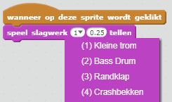
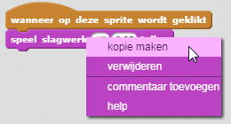

## Uitdaging: je trommel verbeteren

Kun je het geluid veranderen dat de trommel maakt als erop wordt geklikt?



Kun je de trommel ook laten horen als de spatiebalk wordt ingedrukt? Je moet dit `gebeurtenis` blok gebruiken{:class="blockevents"}:

```blocks3
wanneer [spatiebalk] wordt ingedrukt
```

Als je je bestaande code wilt kopiëren, klik je er met de rechtermuisknop op en vervolgens op **dupliceren**.

