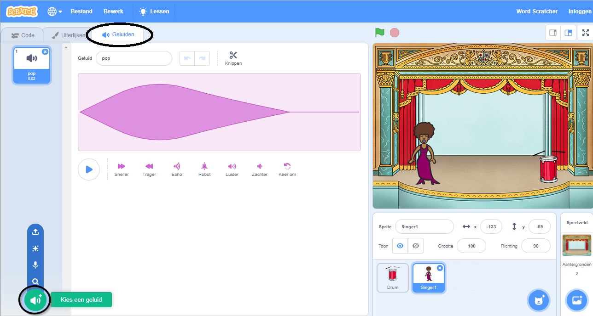
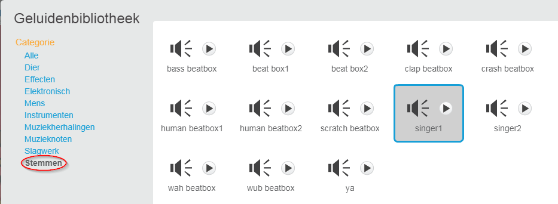

## Een zangeres maken

Nu ga je een zangeres aan je band toevoegen!

--- task ---

Voeg een zangeres sprite toe aan je werkgebied.


[[[generic-scratch3-sprite-from-library]]]

--- /task ---

--- task ---

Voordat je je zangeres kunt laten zingen, moet je een geluid aan je sprite toevoegen. Zorg ervoor dat je de zangeres hebt geselecteerd, klik vervolgens op het tabblad Geluiden en klik op **Kies een geluid**:

 --- /task ---

--- task --- Klik op **Stem** in de lijst bovenaan en kies vervolgens een geluid die je aan je sprite wilt toevoegen.

 --- /task ---

--- task --- Om het geluid te gebruiken, voeg je de volgende codeblokken toe aan je zangeres sprite:

```blocks3
when this sprite clicked
play sound (singer1 v) until done
```

--- /task ---

--- task --- Klik op je zangeres op het podium en kijk wat er gebeurt. Zingt ze? --- /task ---