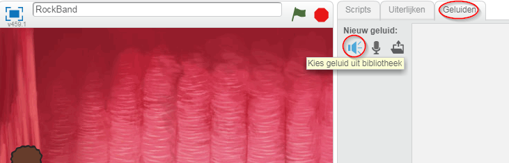

## Een zangeres maken

Laten we een zangeres aan je band toevoegen!

+ Voeg nog twee sprites toe aan je speelveld: een zangeres en een microfoon.
    
    

+ Voordat je je zangeres kunt laten zingen, moet je een geluid aan je sprite toevoegen. Zorg ervoor dat je de zangeres hebt geselecteerd, klik vervolgens op het tabblad Geluiden en klik op **Kies geluid uit bibliotheek**:
    
    

+ Als je aan de linkerkant op **Stemmen** klikt, kun je een geschikt geluid kiezen om toe te voegen aan jouw sprite.
    
    

+ Nu het geluid is toegevoegd, kun je deze code aan je zangeres toevoegen:
    
```blocks
wanneer op deze sprite wordt geklikt 
start geluid [singer1] en wacht
```

+ Klik op je zangeres en kijk wat er gebeurt. Zingt ze?