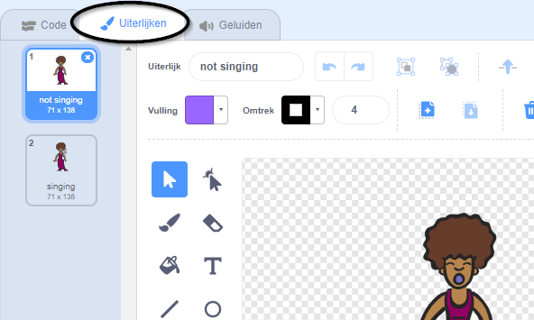
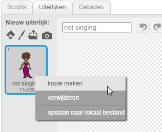
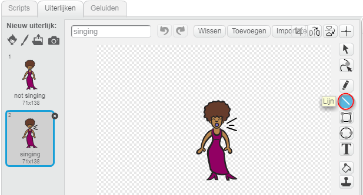
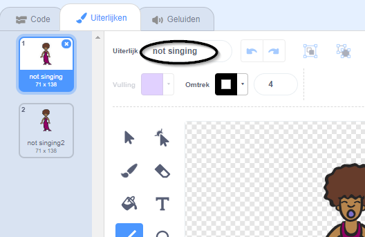

## Uiterlijken

Laten we ervoor zorgen dat je zangeres eruitziet alsof ze zingt!

--- task --- Je kunt de zangeres sprite aanpassen hoe deze eruit ziet als er op wordt geklikt door een nieuw uiterlijk te maken. Klik op het tabblad Uiterlijken en je ziet de afbeelding van de zangeres.

 --- /task ---

--- task --- Klik met de rechtermuisknop op het kostuum en klik vervolgens op **dupliceren** om er een kopie van te maken.

 --- /task ---

--- task --- Klik op het nieuwe kostuum (genaamd 'Singer2') en selecteer vervolgens het lijn gereedschap en teken lijnen om het te laten lijken alsof je zangeres een geluid maakt.

 --- /task ---

--- task --- De namen van de kostuums zijn op dit moment niet erg behulpzaam. Typ in de tekstvakken van de kostuums om hun naam te wijzigen in 'not singing' en 'singing'.

 --- /task ---

--- task --- Nu je twee verschillende kostuums hebt voor je zangeres, kun je kiezen welk kostuum wordt weergegeven! Voeg deze twee blokken toe aan je zangeres:

```blocks3
when this sprite clicked
+switch costume to (singing v)
play sound (singer1 v) until done
+switch costume to (not singing v)
```

Het codeblok voor het veranderen van het uiterlijk vindt je in de `Uiterlijken`{:class="block3looks"} sectie --- /task ---

--- task --- Klik op je zangeres op het podium en kijk wat er gebeurt. Zingt ze? --- /task ---

--- task --- Kun je je trommel laten lijken alsof erop wordt geslagen!


- Gebruik de instructies om je te helpen om het kostuum van je zanger sprite te veranderen.

Vergeet niet om je nieuwe code te testen! --- /task ---