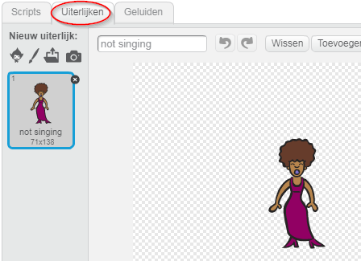
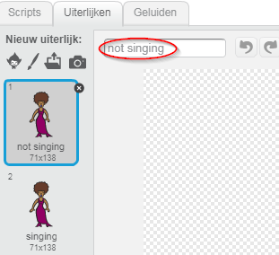
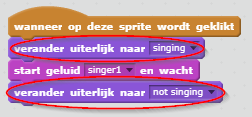

## Uiterlijken

Laten we ervoor zorgen dat je zangeres eruitziet alsof ze zingt!

+ Als er op de zangeres sprite wordt geklikt kun je het plaatje aanpassen door een nieuw uiterlijk te maken. Klik op het tabblad Uiterlijken en je ziet de afbeelding van de zangeres.
    
    

+ Klik met de rechtermuisknop op het uiterlijk en klik op **kopie maken** om een ​​kopie van het uiterlijk te maken.
    
    

+ Klik op het nieuwe kostuum (genaamd 'Singer2') en selecteer vervolgens het lijngereedschap en teken lijnen om het te laten lijken alsof je zangeres een geluid maakt.
    
    

+ De namen van de uiterlijken zijn op dit moment niet erg behulpzaam. Hernoem de twee uiterlijken zodat ze not singing' en 'singing' worden genoemd door de nieuwe naam van elk kostuum in het tekstvak te typen.
    
    

+ Nu je twee verschillende kostuums hebt voor je zangeres, kun je kiezen welk kostuum wordt weergegeven! Voeg deze twee blokken toe aan je zangeres:
    
    
    
    Het codeblok voor het veranderen van het uiterlijk vindt je in de `Uiterlijken`{:class="blocklooks"} sectie.

+ Klik op je zangeres. Lijkt het alsof ze zingt?