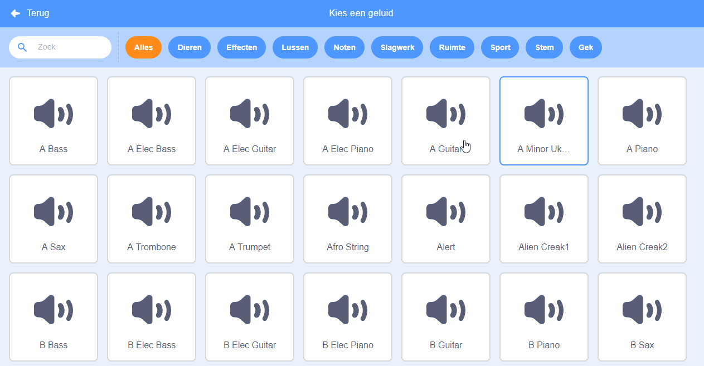
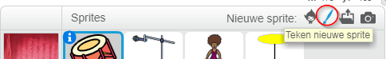
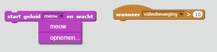

## Uitdaging: verbeter je band

Gebruik wat je in dit project hebt geleerd om je eigen band te maken! Je kunt elk gewenst instrument maken - bekijk de beschikbare geluiden en instrumenten om ideeën op te doen.



```blocks3
wanneer op deze sprite wordt geklikt :: events
gebruik instrument ((1) Piano v) :: music
speel noot (60) (0.25) tellen :: music
```

Je instrumenten hoeven niet te bestaan. Je zou bijvoorbeeld een piano kunnen maken van muffins!


Je kunt meer sprites uit de bibliotheek gebruiken en je kunt ook je eigen sprites maken!



## \--- collapse \---

## title: Waarom springt mijn sprite wanneer het uitelijk verandert?

Bij het maken van je eigen sprite, merk je dat wanneer je op de sprite klikt, deze verspringt wanneer het uiterlijk verandert. Dit komt omdat het centrum van de twee uiterlijken niet op precies dezelfde plek staan.

Om dit op te lossen, zorg je ervoor dat het centrum van je beide sprite kostuums op hetzelfde punt liggen.

\--- /collapse \---

Als je een microfoon hebt kun je je eigen geluiden opnemen of zelfs een webcam gebruiken om je instrumenten te bespelen!

