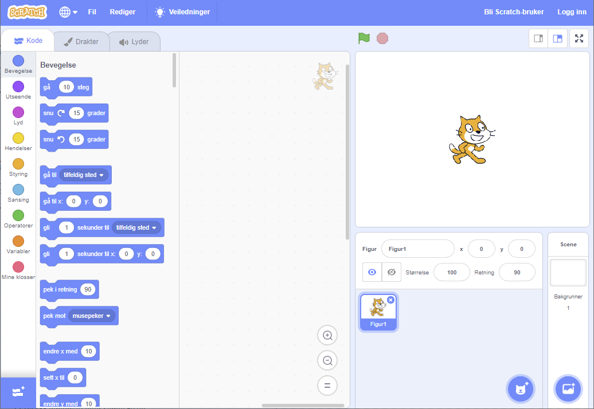
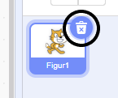
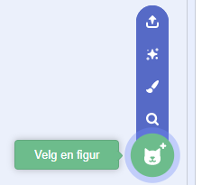
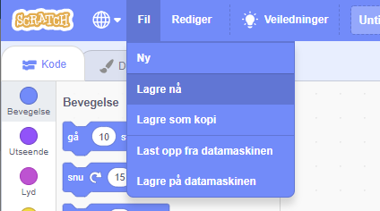

## Figurer

Før du kan starte kodingen, må du legge til en "ting" som kan kodes. I Scratch kalles disse "tingene" **figurer**.

\--- task \--- Åpne et nytt Scratch-prosjekt.

**Online:** åpne et nytt nettbasert Scratch-prosjekt på [rpf.io/scratch-new](http://rpf.io/scratch-new){:target="_blank"}.

**Offline:** åpne et nytt prosjekt i den frakoblede editoren.

Hvis du trenger å laste ned og installere Scratch editoren, finner du den på [rpf.io/scratchoff](http://rpf.io/scratchoff){:target="_blank"}.

Den ser slik ut:

 \--- /task \--- \--- task \--- Kattefiguren som du ser er Scratch sin maskot. Du trenger den ikke i dette spillet, så du kan fjerne den ved å høyreklikke på den og så velge **slett**.

 \--- /task \---

\--- task \--- Klikk deretter **Velg en figur** for å åpne en liste med alle figurene i Scratch.

 \--- /task \---

\--- task \--- Bla nedover til du ser en figur med tromme. Klikk på en tromme for å legge den til i prosjektet ditt.

\--- /task \---

\--- task \---

Klikk og dra trommen til bunnen av scenen.

\--- /task \---

\--- task \--- Gi programmet et navn ved å skrive inn i tekstboksen øverst.

Så klikker du **Fil** og deretter **Lagre nå** for å lagre prosjektet.

Hvis du ikke er online eller ikke har en Scratch-konto, kan du lagre en kopi av prosjektet ved å klikke på **Lagre på datamaskinen** i stedet.

 \--- /task \---