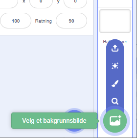
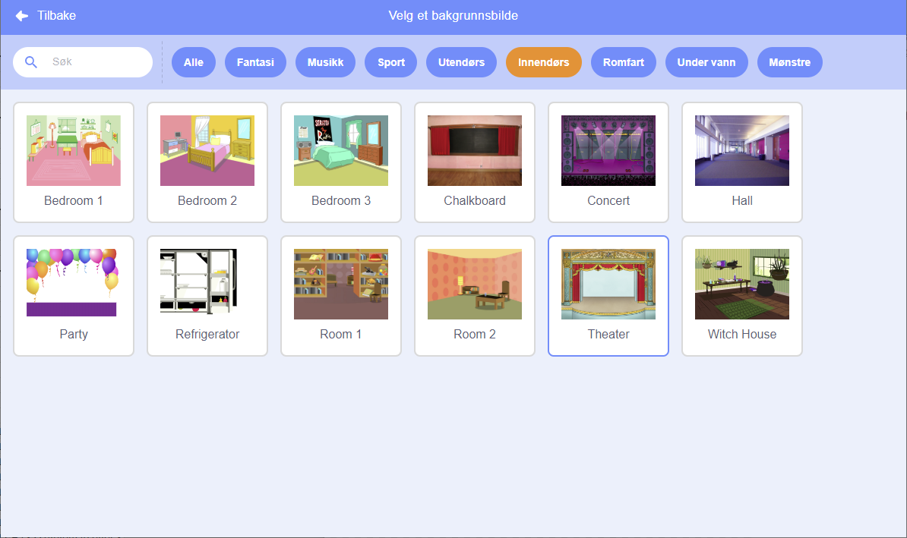

## Scenen

**Scenen** er området til høyre, og det er her prosjektet ditt kommer til live. Tenk på det som et forestillingsområde, akkurat som en ekte scene!

--- task --- For øyeblikket er scenen hvit og ser ganske kjedelig ut! Legg til en bakgrunn ved å klikke på **Velg et bakgrunnsbilde**.

 --- /task ---

--- task --- Klikk på **Innendørs** i listen øverst. Klikk deretter på teaterbakgrunnen (Theater).

 --- /task ---

--- task --- Scenen din skal nå se ut som denne:

 --- /task ---