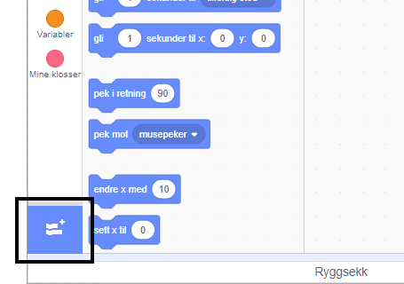
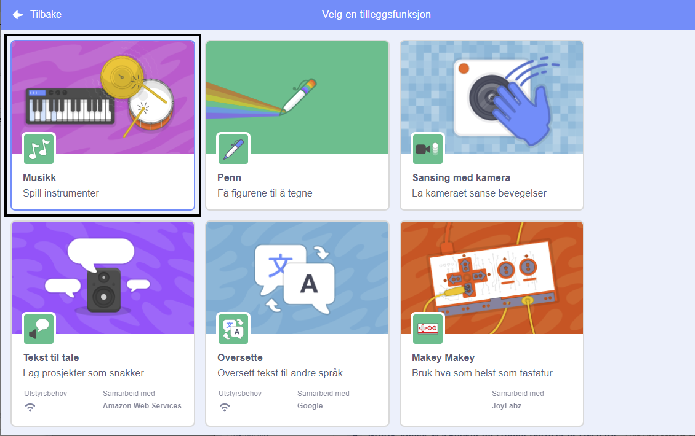
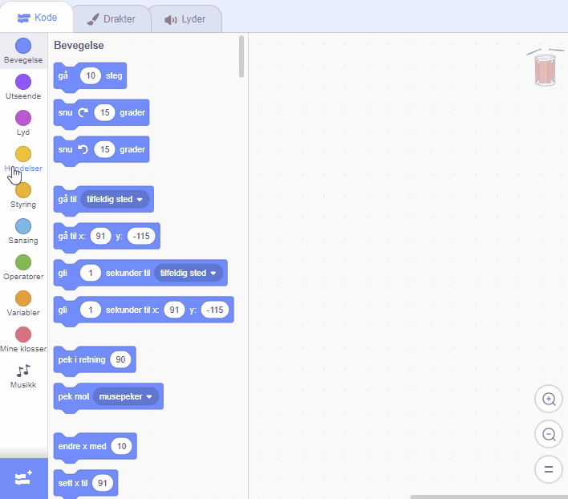

## Lage en tromme

Nå skal du legge til kode på trommen din, slik at den lager lyd når du klikker på den.

Du finner kodeklossene i Kode-arkfanen, og alle er fargekodet!

\--- task \---

Legg til tilleggsfunksjonen **Musikk** slik at du kan spille musikkinstrumenter.

Klikk på **Hent tilleggsfunksjon**-knappen i nedre venstre hjørne.



Klikk på **Musikk**-utvidelsen for å legge den til.



\--- /task \---

\--- task \---

Click on the drum sprite, and then drag these two blocks into the code area on the right:

```blocks3
når denne figuren klikkes
trommeslag (\(1\) Skarptromme v) som varer (0.25) takter
```

\--- no-print \---



\--- /no-print \---

Make sure that the blocks are connected together (like LEGO bricks).

\--- /task \---

\--- task \---

Click on the drum to try out your new instrument!

\--- /task \---