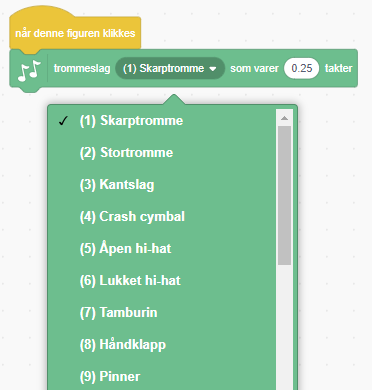
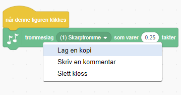

## Utfordring: lag trommen bedre

Klarer du å endre lyden som trommen lager når du klikker på den?



Klarer du også å få trommen til å lage lyd når du trykker på mellomromtasten? Du må bruke `Hendelser`{:class="block3events"} klossen:

```blocks3
når [mellomrom v] trykkes
```

Hvis du vil kopiere en eksisterende kodeblokk, kan du høyreklikke på den og velge **Lag en kopi**.

