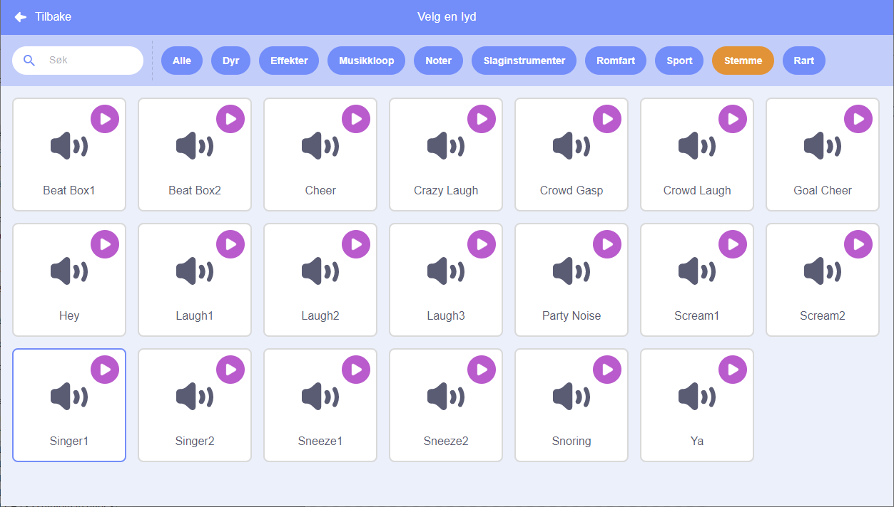

## Lag en sangerinne

Nå skal du legge til en sangerinne i bandet ditt!

--- task ---

Legg til en figur på scenen din.


[[[generic-scratch3-sprite-from-library]]]

--- /task ---

--- task ---

Før du kan få sangerinnen til å synge, må du legge til en lyd på figuren av sangerinnen. Forsikre deg om at du har valgt sangerinne-figuren, deretter klikker på Lyd-arkfanen, og klikk på **Velg en lyd**:

 --- /task ---

--- task --- Klikk på **Stemme** i listen øverst, og velg deretter en lyd du vil legge til figuren din.

 --- /task ---

--- task --- For å bruke lyden, kan du legge til følgende kodeklossen til sangerinne figuren:

```blocks3
når denne figuren klikkes
spill lyden (singer1 v) til den er ferdig
```

--- /task ---

--- task --- Klikk på sangerinnen på scenen og se hva som skjer. Synger hun? --- /task ---