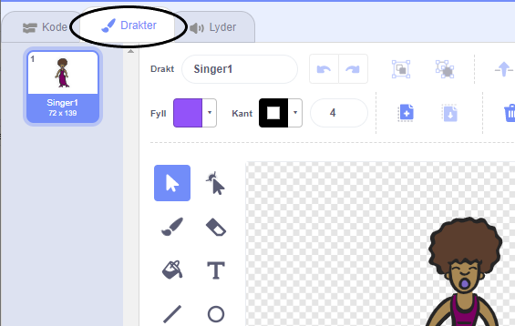
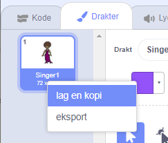
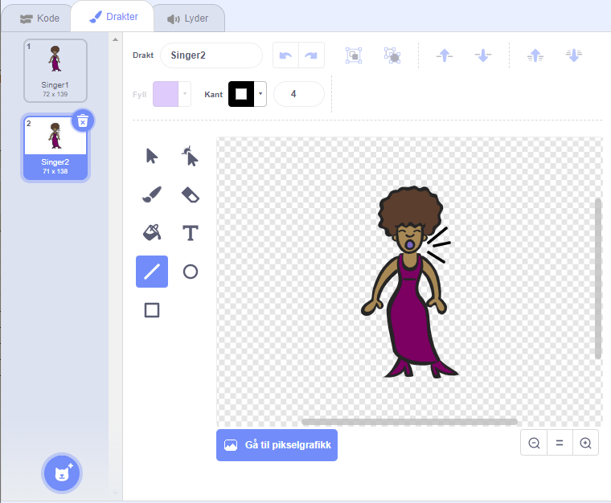
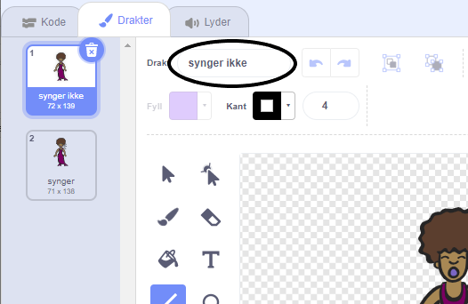

## Drakter

Nå skal du gjøre slik at du ser at sangerinnen synger!

--- task --- Du kan endre hvordan sangerinne-figuren ser ut når du klikker på den ved å lage en ny drakt. Klikk på Drakter-arkfanen, så ser du sangerinnens drakter.

 --- /task ---

--- task --- Høyreklikk på drakten og klikk deretter på **lag en kopi** for å lage en kopi av den.

 --- /task ---

--- task --- Klikk på den nye drakten (kalt 'Singer2'), og velg deretter linjeverktøyet og tegn noen linjer slik at det ser ut som om sangerinnen din synger.

 --- /task ---

--- task --- Navnene på draktene hjelper ikke så mye for øyeblikket. Skriv inn i tekstboksene til draktene for å endre navn til 'synger ikke' og 'synger'.

 --- /task ---

--- task --- Nå som du har to forskjellige drakter til sangerinnen, kan du velge hvilken drakt som skal vises! Legg til disse to kodeklossene til din sangerinne-figur:

```blocks3
når denne figuren klikkes
+bytt drakt til (synger v)
spill lyden (Singer1 v) til den er ferdig
+bytt drakt til (synger ikke v)
```

Kodeklossen for å endre drakt er i `Utseende`{:class="block3looks"} delen. --- /task ---

--- task --- Klikk på sangerinnen din på scenen. Ser du at hun synger? --- /task ---

--- task --- Nå kan du gjøre slik at det ser som trommen blir slått på!


- Bruk instruksjonene for hvordan endre drakten til sangerinnen din som hjelp.

Husk å teste at den nye koden din fungerer! --- /task ---