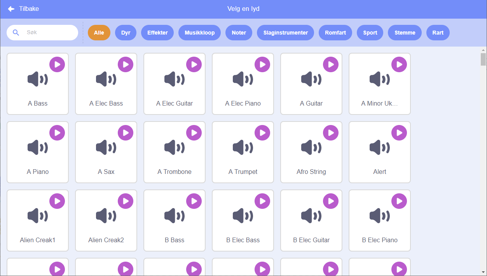
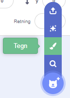
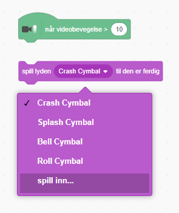

## Utfordring: lag bandet ditt bedre

Bruk det du har lært i dette prosjektet for å lage ditt egen band! Du kan lage akkurat de instrumentene du har lyst til — se på de tilgjengelige instrument-figurene og lydene for å få noen ideer.



```blocks3
når denne figuren klikkes
velg instrument (\(1\) Piano v)
spill tone (60) som varer (0.25) takter
```

Instrumentene dine trenger ikke å være realistiske. For eksempel kan du lage et piano av muffins!


Du kan bruke flere figurer fra biblioteket, og du kan også tegne dine egne figurer!



--- collapse ---
---
title: Hvorfor 'hopper' figuren min når den bytter drakt?
---

Når du lager din egen figur, kan du oppleve at når du klikker på den, 'hopper' den når den skifter drakt. Dette er fordi de to draktene ikke er sentrert på samme sted.

For å fikse dette må du sørge for at midten på alle draktene er på samme sted.

--- /collapse ---

Hvis du har en mikrofon, kan du spille inn dine egne lyder, og du kan til og med bruke et webkamera for å spille på instrumentene dine!

