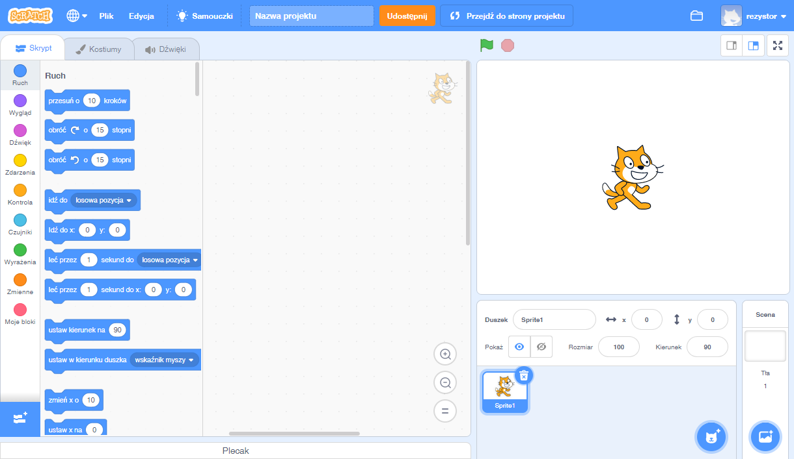
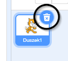
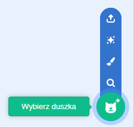
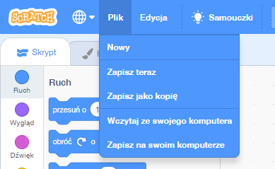

## Duszki

Zanim zaczniesz kodować, musisz dodać pewną „rzecz”, której będzie dotyczył twój kod. W Scratchu takie „rzeczy” nazywane są **duszkami**.

\--- task \--- Otwórz nowy projekt Scratcha.

**Online:** otwórz nowy projekt Scratcha na stronie [rpf.io/scratchon](http://rpf.io/scratchon){:target="_blank"}.

**Offline:** otwórz nowy projekt w edytorze offline.

Jeśli musisz pobrać i zainstalować edytor Scratcha, znajdziesz go na stronie [rpf.io/scratchoff](http://rpf.io/scratchoff){:target="_blank"}.

Wygląda to tak:

 \--- /task \--- \--- task \--- Kot widoczny na ekranie to maskotka Scratcha. Nie jest potrzebny do tej gry, więc usuń go, klikając go prawym przyciskiem myszy, a następnie klikając **usuń**.

 \--- /task \---

\--- task \--- Następnie kliknij **Wybierz duszka z biblioteki**, żeby otworzyć listę wszystkich duszków dostępnych w Scratchu.

 \--- /task \---

\--- task \--- Przewijaj menu w dół, aż zobaczysz duszka wyglądającego jak bębenek. Kliknij na ten bębenek, żeby dodać go do swojego projektu.

\--- /task \---

\--- task \---

Kliknij i przeciągnij bębenek ku dolnej części Sceny.

\--- /task \---

\--- task \--- Wpisz nazwę programu w polu tekstowym w górnej części ekranu.

Then click on **File**, and then on **Save now** to save your project.

If you are not online or don't have a Scratch account, you can save a copy of your project by clicking on **Save to your computer** instead.

 \--- /task \---