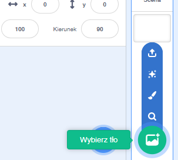
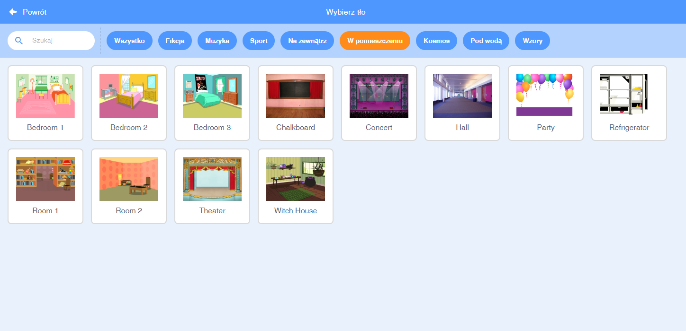

## Scena

**Scena** to obszar po prawej stronie i miejsce, w którym twój projekt ożywa. To miejsce, w którym odbywają się występy – jak na prawdziwej scenie!

\--- task \--- Obecnie scena jest biała i wygląda dość nieciekawie! Dodajmy do niej tło, klikając **Wybierz tło**.

 \--- /task \---

Wybierz z listy u góry opcję **Wnętrza**. Następnie kliknij na tło przedstawiające teatr.

 \--- /task \---

\--- task \--- Twoja scena powinna teraz wyglądać podobnie do tej:

 \--- /task \---