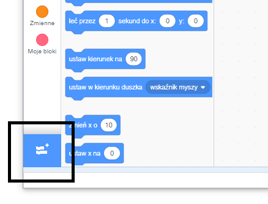
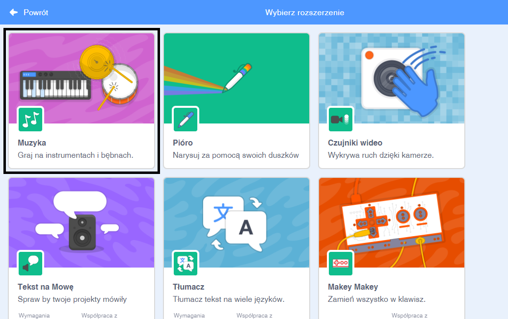
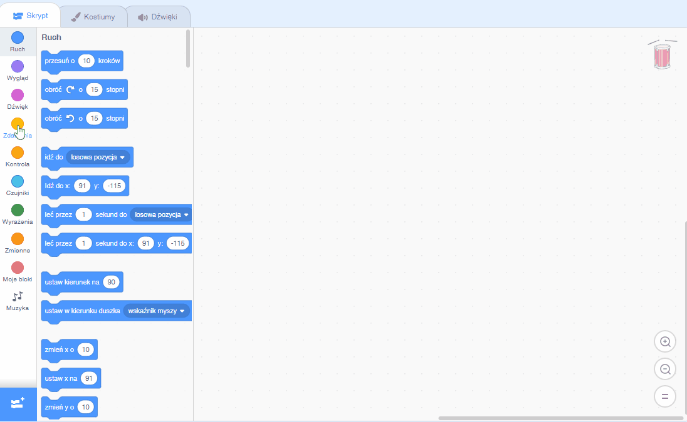

## Tworzenie bębenka

Dodasz do swojego bębenka kod, dzięki któremu po kliknięciu będzie wydawał dźwięk.

Bloki kodu znajdziesz w zakładce Skrypty. Wszystkie są opisane kolorami!

--- task ---

Najpierw włącz dodatek **Muzyka**, żeby móc grać na instrumentach.

Kliknij na przycisk **Dodaj rozszerzenie** w lewym dolnym rogu.



Kliknij na opcję **Muzyka**, żeby dodać to rozszerzenie.



--- /task ---

--- task --- Kliknij na duszka-bębenek, a następnie przeciągnij oba bloki do miejsca na kod po prawej stronie:

```blocks3
when this sprite clicked
play drum ((1) Snare Drum v) for (0.25) beats
```

--- no-print ---



--- /no-print ---

Upewnij się, że bloki są ze sobą połączone (jak klocki LEGO).

--- /task ---

--- task --- Kliknij na bębenek, żeby wypróbować nowy instrument! --- /task ---