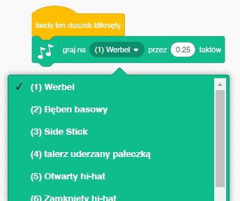
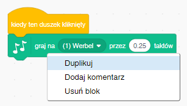

## Wyzwanie: ulepsz swój bębenek

Czy możesz zmienić dźwięk bębenka, gdy zostanie kliknięty?



Czy możesz także uzyskać dźwięk bębenka, gdy zostanie naciśnięty klawisz spacji? Będziesz musiała użyć tego bloczku `zdarzenie`{:class="block3events"}:

```blocks3
when [spacja v] key pressed
```

Jeśli chcesz skopiować swój istniejący kod, kliknij go prawym przyciskiem myszy, a następnie kliknij na **duplikuj**.

