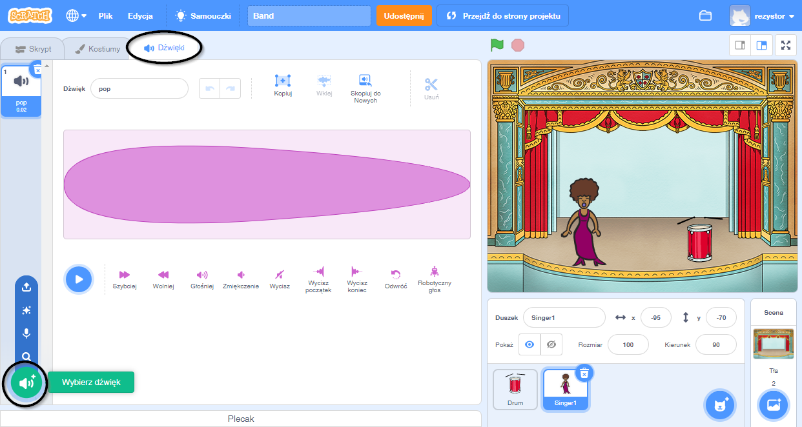
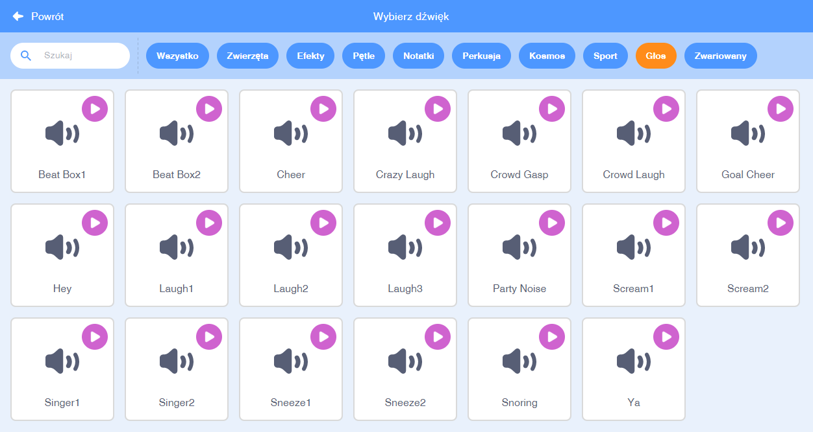

## Dodawanie wokalistki

Teraz dodasz wokalistkę do swojego zespołu!

--- task ---

Dodaj duszka wokalistki do swojej sceny.


[[[generic-scratch3-sprite-from-library]]]

--- /task ---

--- task ---

Zanim będziesz mogła spowodować, żeby Twoja wokalistka zaśpiewała, musisz dodać dźwięk do duszka wokalistki. Upewnij się, że wybrałaś duszka dla swojej wokalistki, a następnie kliknij zakładkę Dźwięki i kliknij **Wybierz dźwięk**:

 --- /task ---

--- task --- Kliknij na **Głos** na liście u góry, a następnie wybierz dźwięk, który chcesz dodać do swojego duszka.

 --- /task ---

--- task --- Aby użyć dźwięku, dodaj następujące bloczki kodu do duszka wokalistki:

```blocks3
when this sprite clicked
play sound (singer1 v) until done
```

--- /task ---

--- task --- Kliknij na wokalistkę na scenie i zobacz co się stanie. Czy ona śpiewa? --- /task ---